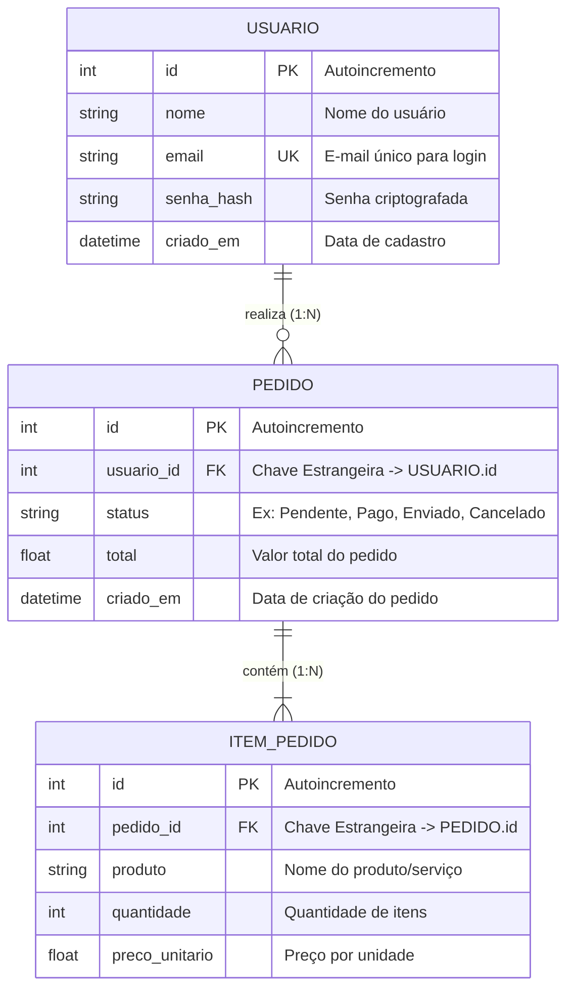
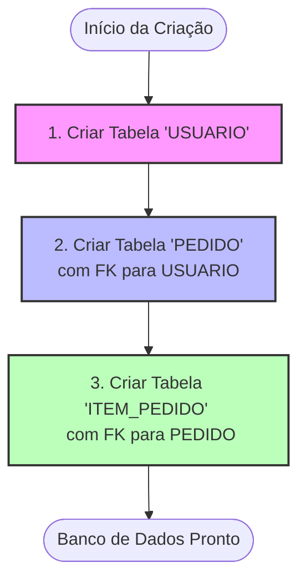

# Fluxograma de Banco de Dados (Database ERD & Flow)

Este documento descreve o fluxo de criação e relacionamento do banco de dados para a aplicação, contendo as entidades de **Usuário**, **Pedido** e **Itens do Pedido**.

---

## 📊 Diagrama de Entidade-Relacionamento (ERD)

Abaixo está o modelo relacional em formato de diagrama Mermaid:

---

## 🔄 Fluxo de Criação das Tabelas (Ordem de Dependência)

Para criar o banco de dados com chaves estrangeiras sem violar restrições de integridade referencial, a criação deve seguir o fluxo abaixo:

---

## 📝 Descrição das Tabelas e Atributos

### 1. Tabela: `usuario`
Armazena as informações cadastrais dos clientes/usuários.

| Campo | Tipo | Restrições | Descrição |
| :--- | :--- | :--- | :--- |
| `id` | `Integer` | Primary Key, Autoincrement | Identificador único do usuário. |
| `nome` | `String(150)` | Not Null | Nome completo do usuário. |
| `email` | `String(150)` | Not Null, Unique, Index | Endereço de e-mail (usado para login). |
| `senha_hash` | `String(255)` | Not Null | Hash da senha de segurança. |
| `criado_em` | `DateTime` | Not Null, Default `func.now()` | Timestamp de quando o registro foi criado. |

### 2. Tabela: `pedido`
Armazena o cabeçalho das compras feitas na plataforma.

| Campo | Tipo | Restrições | Descrição |
| :--- | :--- | :--- | :--- |
| `id` | `Integer` | Primary Key, Autoincrement | Identificador único do pedido. |
| `usuario_id` | `Integer` | Foreign Key (`usuario.id`), Not Null | Relaciona o pedido a um usuário específico. |
| `status` | `String(50)` | Not Null, Default `'pendente'` | Estado atual (ex: `pendente`, `pago`, `cancelado`). |
| `total` | `Float` | Not Null, Default `0.0` | Valor total acumulado do pedido. |
| `criado_em` | `DateTime` | Not Null, Default `func.now()` | Data e hora em que a compra foi iniciada. |

### 3. Tabela: `item_pedido`
Armazena as linhas de detalhes (produtos) que pertencem a cada pedido.

| Campo | Tipo | Restrições | Descrição |
| :--- | :--- | :--- | :--- |
| `id` | `Integer` | Primary Key, Autoincrement | Identificador único do item. |
| `pedido_id` | `Integer` | Foreign Key (`pedido.id`), Not Null | Relaciona o item a um pedido específico. |
| `produto` | `String(100)` | Not Null | Nome ou descrição do produto comprado. |
| `quantidade` | `Integer` | Not Null, Default `1` | Quantidade comprada desse produto. |
| `preco_unitario` | `Float` | Not Null | Preço de cada unidade do produto no momento da compra. |
